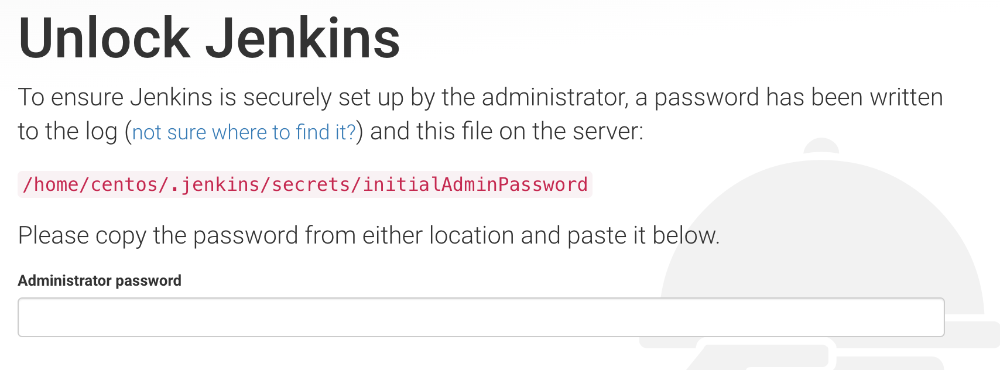
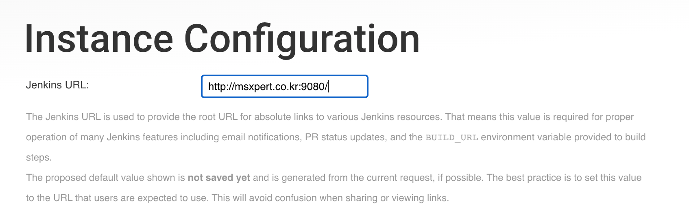
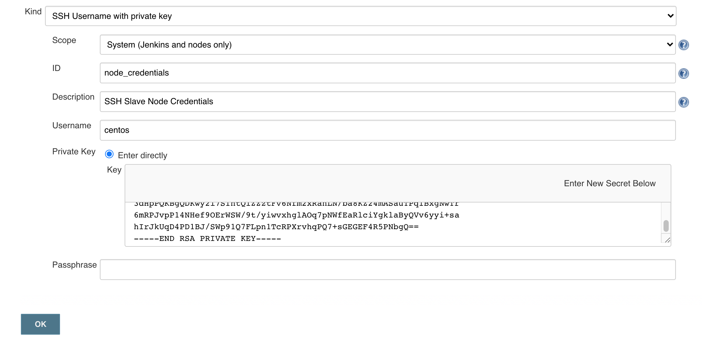
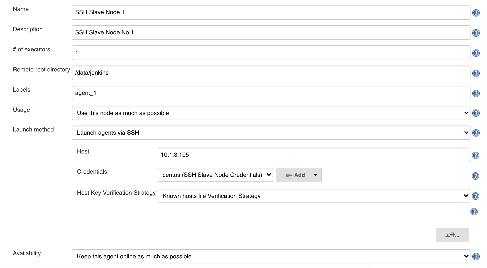
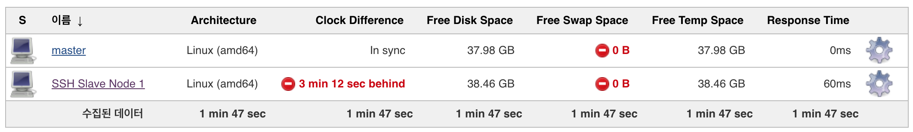

# Jenkins Master - Slave 구성

> 본 방식은 'Java Web Start' 방식이 아닌 SSH 연결을 통한 agents 구성 방식을 사용하고 있음

## # 환경 구성

Master와 Slave 구성을 하기 위해서 총 3개의 인스턴스를 생성하여 구성하였으며, SSH 연결을 위하여 동일한 키페어를 설정.


[^그림 1. 인스턴스 환경 예시]: OS 환경은 centOS7 환경에서 구성하였으며, 용량은 환경에 맞춰서 설정하면 된다.

각 인스턴스에 제공하는 `java-1.8.0-openjdk.tar.gz` `plugins.tar.gz` `jenkins.war` 파일을 옮긴 후 설치를 진행.


## # Jenkins 설치

Jenkins 구성 시 편리한 관리를 위하여 아래와 같이 디렉토리 구조 설정.

```bash
sudo mkdir /app /data /log
sudo chown $USER. /app /data /log

mkdir -p /app/jenkins
mkdir -p /app/util

mv java-1.8.0-openjdk.tar.gz plugins.tar.gz /app/util
mv jenkins.war /app/jenkins
```


### ## Java 설치

Jenkins는 war 파일로 실행을 하며, Jenkins를 실행하기 위해서는 java가 설치되어 있어야 하기 때문에 제공해준 `java-1.8.0-openjdk.tar.gz` 파일로 설치를 진행하며 모든 인스턴스에서 설치 진행.

```bash
cd /app/util
tar -zxvf java-1.8.0-openjdk.tar.gz && cd jdk

sudo rpm -ivh *.rpm

java -version
#openjdk version "1.8.0_252"
#OpenJDK Runtime Environment (build 1.8.0_252-b09)
#OpenJDK 64-Bit Server VM (build 25.252-b09, mixed mode)
```


### ## Jenkins 시작

마스터 인스턴스에서만 Jenkins를 실행 시키는 작업으로 ***첫번째 인스턴스에서만 작업*** 진행.

Jenkins 실행 스크립트

```bash
vi /app/jenkins/start.sh

#!/bin/sh

nohup java -jar /app/jenkins/jenkins.war \
      --httpPort=9080 \
      1> /log/jenkins.log 2>&1 &
echo $! > /data/jenkins.pid
```

Jenkins 중지 스크립트

```bash
vi /app/jenkins/stop.sh

#!/bin/sh

kill $(cat /data/jenkins.pid)
rm -f /data/jenkins.pid
```


## # Jenkins 설정

Jenkins는 설치 후에 기초적으로 설정해야 하는 부분이 존재 하며, air gap 환경에서 제공 된  Jenkins 플러그인 설정이 필요.

다른 작업과 다르게 설정 작업은 화면에서 실행하며, 앞서 Jenkins 시작 스크립트에 설정 한 http port로 접속 가능.


### ## Jenkins 기본 설정



첫 인증 절차로 Jenkins가 실행 인스턴스에서 `cat /home/centos/.jenkins/secrets/initialAdminPassword` 명령을 통해 관리자 패스워드 입력 후 진행 후 플러그인 설치 스킵 후 Jenkins 기본 인증 설정.

 

다음으로는 관리자 계정을 만든 후에 Save and Countinue로 Jenkins 사용 설정.

 

마지막으로 Jenkins URL 설정하게 되면 Jenkins 기본 설정 완료.


### ## Jenkins Plugin 설정

Jenkins가 실행하고 있는 인스턴스에서 제공한 `plugins.tar.gz` 를 이용하여 air gap 환경에서 Jenkins 사용시 필요한 필수 plugin를 설정하는 작업.

```bash
mv plugins.tar.gz /app/util
cd /app/util

tar -zxvf plugins.tar.gz && cd plugins

sudo cp -r * ~/.jenkins/plugins

/app/jenkins/stop.sh
/app/jenkins/start.sh
```

 Jenkins 프로세스가 다시 실행되면 Jenkins 프로세스에서 자동으로 plugin을 인식 후 설치.


## # Jenkins Master Slave 구성 설정

앞서 진행한 작업은 Jenkins의 Master를 구성하는 작업이였으며, 이제 Jenkins를 이용하여 Slave를 구성 설정 진행.


### ## Jenkins credentials 설정



좌측 메뉴에서 Jenkins 관리 > Credentials/System/Add domain > Global credentials > Add Credentials 로 이동하여 설정을 진행합니다.

VM에 접속할 수 있는 Private Key를 등록 한 후에 각 노드 간 인증서 접속이 가능하도록 설정합니다.

> Private Key 생성 방법은 [여기서](SSH_Key.md) 에서 확인하시면 됩니다.


### ## Slave Node 구성




좌측 메뉴에서 Jenkins 관리 > 노드 관리 > 신규 노드 로 이동하여 설정을 진행합니다.

신규 노드 생성 시 각 항목별로 아래와 같이 입력.

| 구분                                           | 내용                                      |
| ---------------------------------------------- | ----------------------------------------- |
| Remote root directory                          | Jenkins 파이프라인이 실행 될 Path         |
| Labels                                         | Slave node 구분 라벨                      |
| Launch method                                  | Launch agents via SSH 로 SSH로 Slave 접속 |
| Launch method > Host                           | Slave 대상 주소                           |
| Launch method > Credentials                    | 앞서 생성한 jenkins credentials           |




저장을 하게 되면 아래와 같이 노드가 하나 생기게 되는데 노드에 들어가 실행을 하게 되면 연결이 된다.


## # ETC

- 마스터 노드에서 슬레이브 노드별로 `known_hosts`에 추가해주면 오류 없이 정상적으로 매끄럽게 연결되는 것을 확인할 수 있다.
- SSH Private Key 이외에 sshd password로도 연결이 가능하지만 네트워크 상태에 따라서 매끄럽지 못한 연결 작업이 될 수 있기 때문에 Private Key를 추천하고 있음.